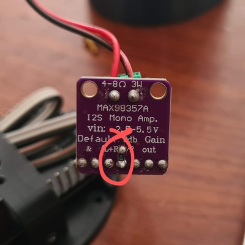

# ESP-TinhTinh

Đây là loa báo nhận tiền chuyển khoản bằng ESP32. Bạn sẽ cần có điện thoại (iPhone) với ứng dụng ngân hàng có sẵn. Để nhận thông báo giao dịch nhận tiền. Khi này ESP32 sẽ đọc số tiền nhận được.

🚀️ Không tốn phí

🚀️ Không API, kết nối là chạy

🚀️ Không cần đăng ký kinh doanh, ...

## Nó hoạt động thế nào

Về cơ bản nó giống như một chiếc đồng hồ thông minh được kết nối với điện thoại của bạn (iPhone). Sau khi kết nối qua Bluetooth, loa cần được cấp quyền đọc các thông báo từ điện thoại.
Nó sẽ dựa theo ID của app để chỉ xử lý các thông báo từ app ngân hàng (mặc định MBBank). Sử dụng regex để lấy ra thông tin cần thiết trong thông báo chuyển khoản, và đọc ra số tiền thông qua mạch I2S bên ngoài.

### Phần cứng

* Board ESP32: https://s.shopee.vn/9KVfaE6ftX
* Module I2S: https://s.shopee.vn/800HzwlVyr
* Loa: Tận dụng gỡ mấy loa đồ chơi

Kết nối dây module I2S:

| ESP32 | I2S module |
| ------- | :----------- |
| 5V    | Vin        |
| GND   | GND        |
| IO13  | DIN        |
| IO12  | BCLK       |
| IO14  | LRC        |

Thay đổi âm lượng (điều chỉnh GAIN của I2S):

| Kết nối vào pin GAIN trên board     | GAIN |
| ----------------------------------------- | :----- |
| Nối với điện trở 100kΩ xuống GND | 15   |
| Nối xuống GND                         | 12   |
| Để trống (mặc định)               | 9    |
| Nối vào Vdd                           | 6    |
| Nối với điện trở 100kΩ lên Vdd   | 3    |

*(hàn thêm trở để âm lượng lớn nhất)*

